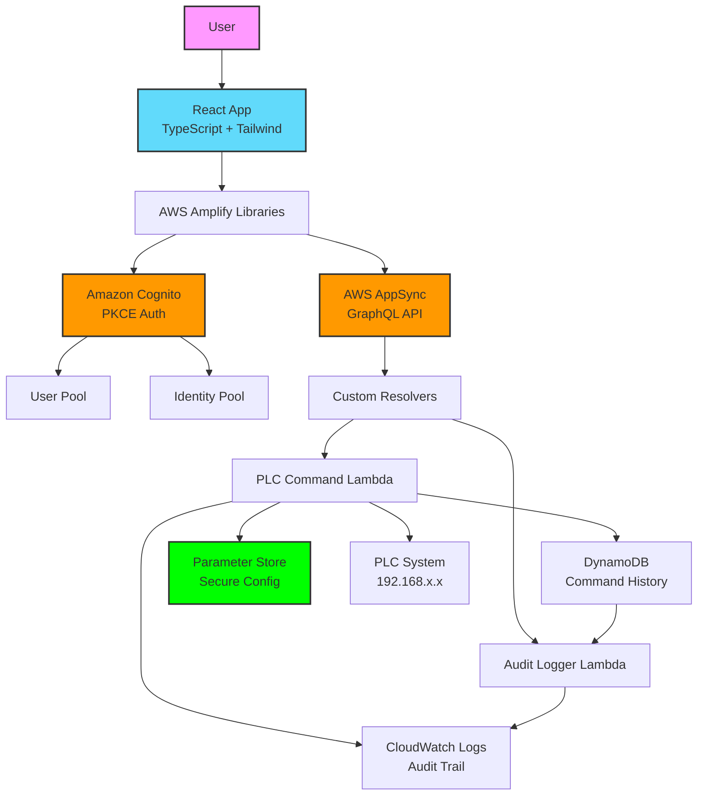
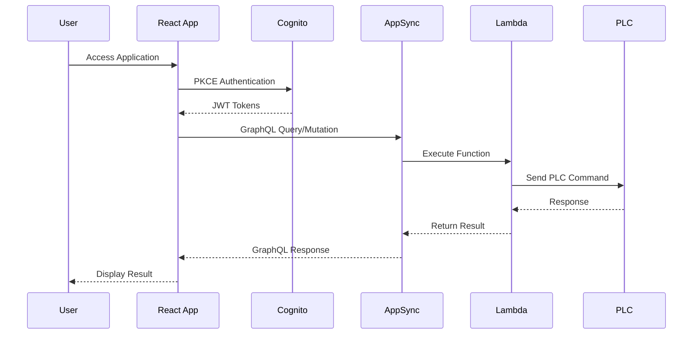

# Amplify Gen2 + React によるセキュアなPLC制御システム

## 概要

このプロジェクトは、AWS Amplify Gen2とReact 19を使用したモダンで安全なPLC制御システムの実装例です。
最新のセキュリティベストプラクティスと、エンタープライズグレードの機能を提供します。

## 主要な特徴

### セキュリティ機能
- ✅ **Built-in PKCE**: Amplify Gen2が自動的にPKCE認証を実装
- ✅ **多要素認証（MFA）**: オプションで有効化可能
- ✅ **Parameter Store統合**: 機密情報の暗号化管理
- ✅ **包括的な監査ログ**: CloudWatch Logsによる全操作記録
- ✅ **Type-safe API**: TypeScriptによる型安全なAPI呼び出し

### 技術スタック
- **フロントエンド**: React 19 + TypeScript + Tailwind CSS
- **バックエンド**: AWS Amplify Gen2
- **認証**: Amazon Cognito（PKCE自動実装）
- **API**: AWS AppSync（GraphQL）
- **データ**: AWS DynamoDB
- **関数**: AWS Lambda
- **ホスティング**: AWS Amplify Hosting

## アーキテクチャ



### シーケンス図



## セキュリティ強化点

### 従来の問題点からの改善
- ❌ → ✅ クライアントシークレット露出 → PKCE自動実装
- ❌ → ✅ 機密情報のハードコード → Parameter Store暗号化
- ❌ → ✅ 型安全性なし → TypeScriptによる完全な型保証
- ❌ → ✅ 監査ログ不足 → 包括的なCloudWatch Logs統合

## 前提条件

- Node.js 18.x 以上
- AWS CLI がインストールされ、適切な権限で設定済み
- npm または yarn

## セットアップ

### 1. リポジトリのクローン

```bash
git clone https://github.com/yuu551/react-amplify.git
cd react-amplify
```

### 2. 依存関係のインストール

```bash
npm install
```

### 3. Amplify 環境の設定

```bash
# Amplify CLIのインストール（未インストールの場合）
npm install -g @aws-amplify/cli

# バックエンドのデプロイ
npx ampx sandbox
```

### 4. 環境設定の更新

`amplify/backend.ts` を編集して、以下の値を実際の環境に合わせて変更してください：

```typescript
// Parameter Store設定
const plcIpParam = new ssm.StringParameter(functionStack, 'PlcIpParameter', {
  parameterName: '/plc/secure/ip-address',
  stringValue: 'YOUR_PLC_IP_ADDRESS', // 実際のPLC IPアドレス
  // ...
});

const mqttTopicParam = new ssm.StringParameter(functionStack, 'MqttTopicParameter', {
  parameterName: '/plc/secure/mqtt-topic',
  stringValue: 'your-mqtt-topic/device/gateway', // 実際のMQTTトピック
  // ...
});
```

### 5. amplify_outputs.json の設定

`amplify_outputs.json.example` を `amplify_outputs.json` にコピーし、実際の値を設定してください：

```bash
cp amplify_outputs.json.example amplify_outputs.json
# ファイルを編集して実際の値を設定
```

### 6. ローカル開発サーバーの起動

```bash
npm run dev
```

## 使用方法

### 認証フロー

1. アプリケーションにアクセス
2. Amplify Authenticatorコンポーネントで自動的に認証画面表示
3. メールアドレス/パスワードでサインアップ/サインイン
4. 認証完了後、PLC制御画面にアクセス可能

### PLC制御

認証後、以下の操作が可能です：

- **コマンド選択**: read/write
- **エリア選択**: DM/HR/WR
- **アドレス入力**: メモリアドレス
- **値入力**: 書き込み値（writeの場合）

### 監査ログ表示

「監査ログ」タブで以下の情報を確認できます：
- 操作履歴
- ユーザー情報
- タイムスタンプ
- 実行結果

## プロジェクト構造

```
react-amplify/
├── amplify/                    # Amplify Gen2 バックエンド設定
│   ├── auth/                   # Cognito認証設定
│   ├── data/                   # GraphQL API設定
│   ├── functions/              # Lambda関数
│   │   ├── plc-command/        # PLC制御関数
│   │   └── audit-logger/       # 監査ログ取得関数
│   └── backend.ts              # バックエンド統合設定
├── src/                        # React アプリケーション
│   ├── components/             # UIコンポーネント
│   │   ├── AuthenticatedApp.tsx  # 認証後のメインアプリ
│   │   ├── PLCController.tsx     # PLC制御UI
│   │   └── AuditLog.tsx          # 監査ログ表示
│   ├── App.tsx                 # アプリケーションエントリー
│   └── main.tsx                # Viteエントリーポイント
├── docs/                       # ドキュメント
│   └── architecture.md         # 詳細なアーキテクチャ説明
└── README.md                   # このファイル
```

## 本番環境への移行

### 1. 実際のPLC通信実装

```typescript
// amplify/functions/plc-command/handler.ts の実装を更新
async function executePlcCommand(params) {
  // TODO: 実際のPLCプロトコル実装
  // - TCP/IP通信
  // - Modbus実装
  // - その他産業用プロトコル
}
```

### 2. ネットワークセキュリティ

- Lambda を VPC 内に配置
- セキュリティグループの適切な設定
- プライベートサブネットでのPLC通信

### 3. 監視・アラート

```typescript
// CloudWatch Alarms の設定
const alarm = new cloudwatch.Alarm(this, 'PlcErrorAlarm', {
  metric: errorMetric,
  threshold: 5,
  evaluationPeriods: 1,
});
```

### 4. 可用性向上

- Multi-AZ構成
- Auto Scaling設定
- バックアップ戦略

## トラブルシューティング

### よくある問題

**Q: amplify sandbox でエラーが発生する**
A: AWS CLIの認証情報と権限を確認してください

**Q: Parameter Store の値が取得できない**
A: Lambda関数のIAM権限を確認してください

**Q: GraphQL APIでエラーが発生する**
A: `amplify_outputs.json` の設定値を確認してください

## セキュリティ考慮事項

1. **最小権限の原則**: IAMロールは必要最小限の権限のみ付与
2. **暗号化**: すべての機密情報はParameter Storeで暗号化
3. **監査**: 全操作がCloudWatch Logsに記録される
4. **認証**: Cognitoによる強固な認証・認可

## パフォーマンス最適化

- React.lazy() によるコード分割
- useMemo/useCallback による再レンダリング最適化
- GraphQL クエリの最適化
- Lambda コールドスタート対策

## コスト最適化

月額コスト概算（1,000 MAU）:
- Amplify Hosting: $0.15
- Cognito: $5.50
- AppSync: $4.00
- Lambda: $1.00
- DynamoDB: $0.25
- **合計**: 約$10.90

## ライセンス

このプロジェクトはMITライセンスの下で公開されています。

## 貢献

バグ報告や機能要求は、GitHubのIssuesでお願いします。

## 関連リンク

- [AWS Amplify Gen2 Documentation](https://docs.amplify.aws/)
- [React Documentation](https://react.dev/)
- [AWS AppSync Documentation](https://docs.aws.amazon.com/appsync/)
- [TypeScript Documentation](https://www.typescriptlang.org/)