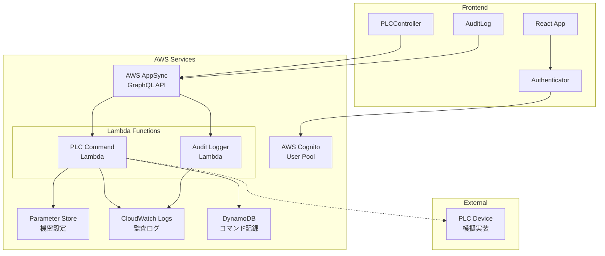
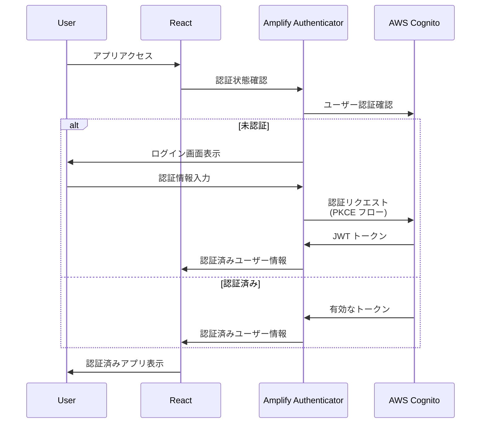
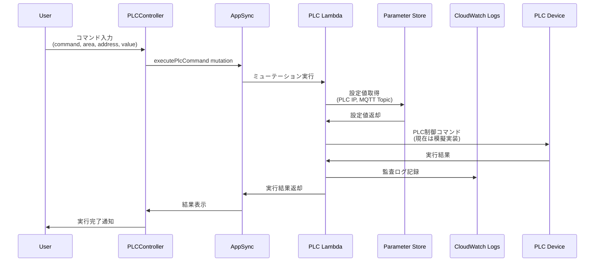
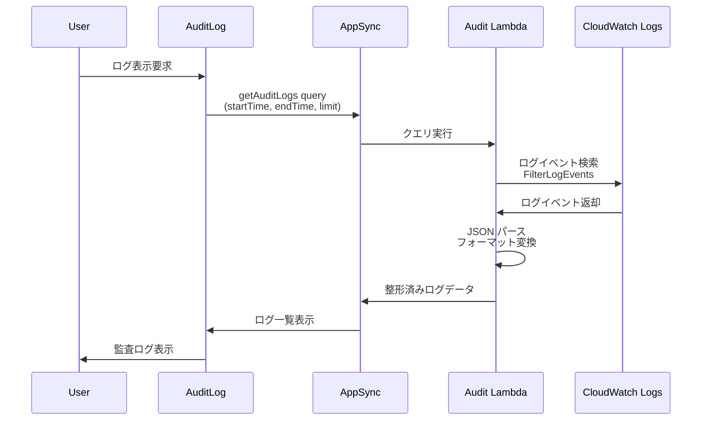

# PLC Control System アーキテクチャドキュメント

## 概要

このシステムは React + AWS Amplify Gen2 を使用した PLC 制御システムです。
AWS Cognito による認証、AppSync のカスタムクエリ/ミューテーション、Lambda 関数を組み合わせた構成になっています。

## 技術スタック

- **フロントエンド**: React 19 + TypeScript + Tailwind CSS
- **認証**: AWS Cognito User Pool
- **API**: AWS AppSync (カスタムクエリ/ミューテーション)
- **バックエンド**: AWS Lambda
- **ログ管理**: AWS CloudWatch Logs
- **設定管理**: AWS Systems Manager Parameter Store
- **インフラ**: AWS CDK (Amplify Gen2)

## 全体アーキテクチャ

## 1. 認証フロー

### 認証の特徴
- **PKCE (Proof Key for Code Exchange)**: Amplify内部で自動実装
- **JWT トークン**: AppSync API の認証に使用
- **MFA**: 現在は無効（設定で有効化可能）

## 2. PLC制御フロー

### PLC制御の特徴
- **カスタムミューテーション**: DataStore 未使用、Lambda直接実行
- **設定の暗号化**: Parameter Store で機密情報管理
- **監査ログ**: 全操作をCloudWatch Logsに記録
- **模擬実装**: 実際のPLC通信は未実装（フレームワークのみ）

## 3. 監査ログフロー

### 監査ログの特徴
- **リアルタイム検索**: CloudWatch Logsから直接取得
- **フィルタリング**: 時間範囲、ステータスでフィルタ可能
- **JSON形式**: 構造化されたログデータ
- **統計情報**: 成功/エラー件数の集計表示

## 4. セキュリティ実装

### 認証・認可
- **Cognito User Pool**: ユーザー管理
- **JWT トークン**: API認証
- **IAM ロール**: Lambda実行権限

### データ保護
- **Parameter Store**: 設定値の暗号化保存
- **VPC**: 本番環境では Lambda を VPC 内に配置予定
- **HTTPS**: 全通信の暗号化

### 監査・ログ
- **CloudWatch Logs**: 全操作の記録
- **ユーザー追跡**: UserId, Email, IP アドレス記録
- **タイムスタンプ**: 全操作の時刻記録

## 5. 本番環境への移行計画

### 現在の状態（PoC環境）
- PLC通信は模擬実装
- ローカル開発環境向け設定
- 基本的なセキュリティ実装

### 本番環境に向けた改善点
1. **実際のPLC通信実装**
   - 使用プロトコル（TCP/IP、Modbus、等）の実装
   - PLC機器との接続テスト

2. **ネットワークセキュリティ強化**
   - Lambda を VPC 内に配置
   - セキュリティグループの適切な設定
   - プライベートサブネットでの PLC 通信

3. **監視・アラート強化**
   - CloudWatch Alarms の設定
   - 異常検知とアラート通知
   - メトリクス監視

4. **可用性向上**
   - Multi-AZ 構成
   - Auto Scaling設定
   - バックアップ戦略

## 6. 運用考慮事項

### ログ管理
- **ログ保持期間**: 現在1ヶ月（要件に応じて調整）
- **ログローテーション**: CloudWatch Logsで自動管理
- **ログ分析**: CloudWatch Insights で詳細分析可能

### コスト最適化
- **Lambda実行時間最適化**: 不要な処理の削減
- **ログストレージ**: 適切な保持期間設定
- **Parameter Store**: Standard tier使用（Advanced tierは必要時のみ）

### パフォーマンス
- **Lambda コールドスタート**: Provisioned Concurrency検討
- **AppSync キャッシュ**: レスポンス時間改善
- **フロントエンド最適化**: React.memo、useMemo活用